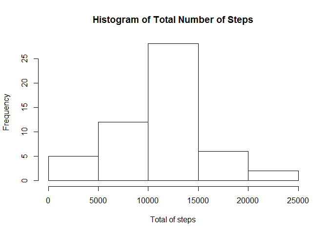
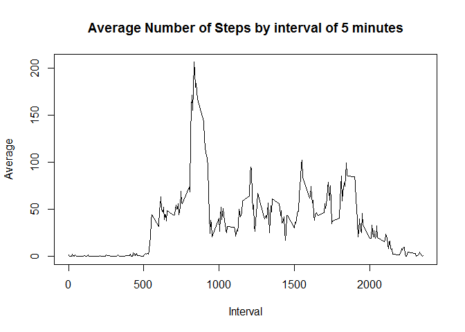
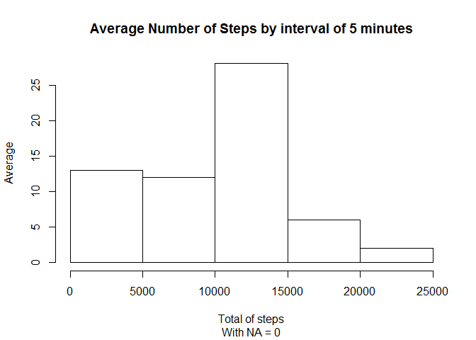
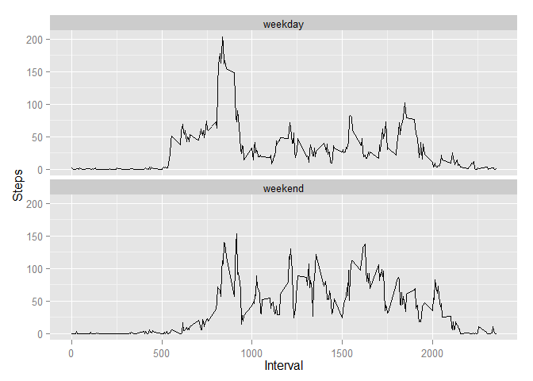

# PA1_template
Ourives  
Sunday, October 19, 2014  

```r
library(ggplot2)
setwd("C:\\Users\\Família\\Documents\\Ciência de Dados\\05 - Reproducible Research\\Peer Assessment 1\\")
base <- read.csv("activity.csv",header = T)
base$date <- as.character(base$date)
base$date <- as.Date(base$date, format="%Y-%m-%d")
baseNA <- is.na(base$steps)
baseClean <- base[!baseNA,]
```


```r
#Hist of the Sum
sum <- tapply(baseClean$steps, baseClean$date, sum)
hist(sum, main ="Histogram of Total Number of Steps", xlab = "Total of steps")
```

 


```r
#Mean
tapply(baseClean$steps, baseClean$date, mean)
```

```
## 2012-10-02 2012-10-03 2012-10-04 2012-10-05 2012-10-06 2012-10-07 
##     0.4375    39.4167    42.0694    46.1597    53.5417    38.2465 
## 2012-10-09 2012-10-10 2012-10-11 2012-10-12 2012-10-13 2012-10-14 
##    44.4826    34.3750    35.7778    60.3542    43.1458    52.4236 
## 2012-10-15 2012-10-16 2012-10-17 2012-10-18 2012-10-19 2012-10-20 
##    35.2049    52.3750    46.7083    34.9167    41.0729    36.0938 
## 2012-10-21 2012-10-22 2012-10-23 2012-10-24 2012-10-25 2012-10-26 
##    30.6285    46.7361    30.9653    29.0104     8.6528    23.5347 
## 2012-10-27 2012-10-28 2012-10-29 2012-10-30 2012-10-31 2012-11-02 
##    35.1354    39.7847    17.4236    34.0938    53.5208    36.8056 
## 2012-11-03 2012-11-05 2012-11-06 2012-11-07 2012-11-08 2012-11-11 
##    36.7049    36.2465    28.9375    44.7326    11.1771    43.7778 
## 2012-11-12 2012-11-13 2012-11-15 2012-11-16 2012-11-17 2012-11-18 
##    37.3785    25.4722     0.1424    18.8924    49.7882    52.4653 
## 2012-11-19 2012-11-20 2012-11-21 2012-11-22 2012-11-23 2012-11-24 
##    30.6979    15.5278    44.3993    70.9271    73.5903    50.2708 
## 2012-11-25 2012-11-26 2012-11-27 2012-11-28 2012-11-29 
##    41.0903    38.7569    47.3819    35.3576    24.4688
```


```r
#Median
tapply(baseClean$steps, baseClean$date, median)
```

```
## 2012-10-02 2012-10-03 2012-10-04 2012-10-05 2012-10-06 2012-10-07 
##          0          0          0          0          0          0 
## 2012-10-09 2012-10-10 2012-10-11 2012-10-12 2012-10-13 2012-10-14 
##          0          0          0          0          0          0 
## 2012-10-15 2012-10-16 2012-10-17 2012-10-18 2012-10-19 2012-10-20 
##          0          0          0          0          0          0 
## 2012-10-21 2012-10-22 2012-10-23 2012-10-24 2012-10-25 2012-10-26 
##          0          0          0          0          0          0 
## 2012-10-27 2012-10-28 2012-10-29 2012-10-30 2012-10-31 2012-11-02 
##          0          0          0          0          0          0 
## 2012-11-03 2012-11-05 2012-11-06 2012-11-07 2012-11-08 2012-11-11 
##          0          0          0          0          0          0 
## 2012-11-12 2012-11-13 2012-11-15 2012-11-16 2012-11-17 2012-11-18 
##          0          0          0          0          0          0 
## 2012-11-19 2012-11-20 2012-11-21 2012-11-22 2012-11-23 2012-11-24 
##          0          0          0          0          0          0 
## 2012-11-25 2012-11-26 2012-11-27 2012-11-28 2012-11-29 
##          0          0          0          0          0
```


```r
#TS plot
avg <- tapply(baseClean$steps, baseClean$interval, mean)
avg_names <- names(avg)
plot(avg_names, avg, type = "l", main = "Average Number of Steps by interval of 5 minutes", xlab = "Interval", ylab = "Average")
```

 


```r
maximo <- avg_names[(avg==max(avg))]

##The interval who have the maximum number of steps is `r maximo`.
```

The interval who have the maximum number of steps is 835.


```r
countNA <- sum(is.na(base$steps))
```

The total number of NAs is 2304

It will be use the 0 to fill the NA in the steps.


```r
base$steps[is.na(base$steps)] <- 0
```


```r
#Hist of the Sum
sum <- tapply(base$steps, base$date, sum)
hist(sum, main = "Average Number of Steps by interval of 5 minutes", sub="With NA = 0", xlab = "Total of steps", ylab = "Average")
```

 


```r
#Mean
tapply(base$steps, base$date, mean)
```

```
## 2012-10-01 2012-10-02 2012-10-03 2012-10-04 2012-10-05 2012-10-06 
##     0.0000     0.4375    39.4167    42.0694    46.1597    53.5417 
## 2012-10-07 2012-10-08 2012-10-09 2012-10-10 2012-10-11 2012-10-12 
##    38.2465     0.0000    44.4826    34.3750    35.7778    60.3542 
## 2012-10-13 2012-10-14 2012-10-15 2012-10-16 2012-10-17 2012-10-18 
##    43.1458    52.4236    35.2049    52.3750    46.7083    34.9167 
## 2012-10-19 2012-10-20 2012-10-21 2012-10-22 2012-10-23 2012-10-24 
##    41.0729    36.0938    30.6285    46.7361    30.9653    29.0104 
## 2012-10-25 2012-10-26 2012-10-27 2012-10-28 2012-10-29 2012-10-30 
##     8.6528    23.5347    35.1354    39.7847    17.4236    34.0938 
## 2012-10-31 2012-11-01 2012-11-02 2012-11-03 2012-11-04 2012-11-05 
##    53.5208     0.0000    36.8056    36.7049     0.0000    36.2465 
## 2012-11-06 2012-11-07 2012-11-08 2012-11-09 2012-11-10 2012-11-11 
##    28.9375    44.7326    11.1771     0.0000     0.0000    43.7778 
## 2012-11-12 2012-11-13 2012-11-14 2012-11-15 2012-11-16 2012-11-17 
##    37.3785    25.4722     0.0000     0.1424    18.8924    49.7882 
## 2012-11-18 2012-11-19 2012-11-20 2012-11-21 2012-11-22 2012-11-23 
##    52.4653    30.6979    15.5278    44.3993    70.9271    73.5903 
## 2012-11-24 2012-11-25 2012-11-26 2012-11-27 2012-11-28 2012-11-29 
##    50.2708    41.0903    38.7569    47.3819    35.3576    24.4688 
## 2012-11-30 
##     0.0000
```


```r
#Median
tapply(base$steps, base$date, median)
```

```
## 2012-10-01 2012-10-02 2012-10-03 2012-10-04 2012-10-05 2012-10-06 
##          0          0          0          0          0          0 
## 2012-10-07 2012-10-08 2012-10-09 2012-10-10 2012-10-11 2012-10-12 
##          0          0          0          0          0          0 
## 2012-10-13 2012-10-14 2012-10-15 2012-10-16 2012-10-17 2012-10-18 
##          0          0          0          0          0          0 
## 2012-10-19 2012-10-20 2012-10-21 2012-10-22 2012-10-23 2012-10-24 
##          0          0          0          0          0          0 
## 2012-10-25 2012-10-26 2012-10-27 2012-10-28 2012-10-29 2012-10-30 
##          0          0          0          0          0          0 
## 2012-10-31 2012-11-01 2012-11-02 2012-11-03 2012-11-04 2012-11-05 
##          0          0          0          0          0          0 
## 2012-11-06 2012-11-07 2012-11-08 2012-11-09 2012-11-10 2012-11-11 
##          0          0          0          0          0          0 
## 2012-11-12 2012-11-13 2012-11-14 2012-11-15 2012-11-16 2012-11-17 
##          0          0          0          0          0          0 
## 2012-11-18 2012-11-19 2012-11-20 2012-11-21 2012-11-22 2012-11-23 
##          0          0          0          0          0          0 
## 2012-11-24 2012-11-25 2012-11-26 2012-11-27 2012-11-28 2012-11-29 
##          0          0          0          0          0          0 
## 2012-11-30 
##          0
```

Comparing the two histograms, we realized that there was no great difference in the values, only the concentration of 0 in the histogram was evidenced.


```r
base$steps[is.na(base$steps)] <- 0

base$weekday <- weekdays(base$date)
base$w2 = "weekday"

base$w2[(weekdays(base$date) %in% c('sábado','domingo'))] <- "weekend"
base$w2 <- as.factor(base$w2)
```


```r
base_w2 <- aggregate( steps~w2+interval, base, mean )
qplot(interval,steps,data=base_w2,geom="line", facets = .~w2, xlab ="Interval" , ylab ="Steps") + facet_wrap(~w2,nrow = 2, ncol = 1)
```

 
